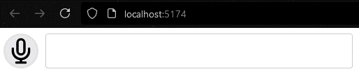
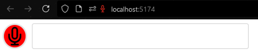
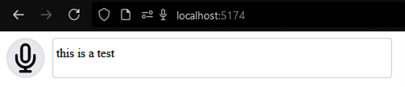

# Vue voice input component

This component adds a button that allows users to record audio through their microphone using Web APIs‘ [MediaRecorder interface](https://developer.mozilla.org/en-US/docs/Web/API/MediaRecorder) and send the audio data to a specified backend server URL for processing. It also provides a component to display the response or other input with a „typing effect“ (similar to chatGPT).

## Features

Packages has three components:

- `VoiceButton` – allows to send record audio input using Web API MediaRecorder interaface and send it to a specified backend URL
- `VoiceTranscript` – allows to display input string as being typed out one letter at a time
- `VoiceTranscriptComponent` – combines both components to have an interface component that records audio, sends it to the backend for processing and then displays the response

## Usage examples

Install using this command:

```bash
npm -i vue-voice-inout-component
```

Then to use the voice input button:

```javascript
<script setup lang="ts">
import { VoiceButton } from 'vue-voice-input-component';
</script>

<template>
  <div>
    <VoiceButton
      api-endpoint="http://localhost:3000/api/speech-to-text"
    />
  </div>
</template>
```

To use the transcript component seperately:

```javascript
<script setup lang="ts">
import { VoiceTranscript } from 'vue-voice-input-component';
</script>

<template>
  <div>
    <VoiceTranscript
      transcription="This is a test transcription"
    />
  </div>
</template>
```

And finally the combined component has both the button and the transcript component:

```javascript
<script setup lang="ts">
import { VoiceTranscriptComponent } from 'vue-voice-input-component';
</script>

<template>
  <div>
    <VoiceTranscriptComponent
      api-endpoint="http://localhost:3000/api/speech-to-text"
    />
  </div>
</template>
```

> Note: the combined `VoiceTranscriptComponent` expects the backend response to have a transcription key value pairs that is then passed to the transcription component to be validated and  displayed.

## Component properties

`VoiceButton` component properties:

| Name | Type | Optional | Default value | Description |
|------|------|----------|---------------|-------------|
| apiEndpoint | String | False | - | API URL where the audio binary data is sent |
| maxDuration | Number | True | 5000ms | Maximum recording duration |
| apiHeaders | Object | True | undefined | Custom HTTP request headers that are added to API request |
| formDataTag | String | True | audio | Audio data value name in API request body |
| audioContraints | Object | True | {channelCount: 1, echoCancellation: false, sampleRate: 16000} | Audio stream constraints. More options can be found [here](https://developer.mozilla.org/en-US/docs/Web/API/MediaTrackConstraints#instance_properties_of_audio_tracks) |
| blobType | String | True | audio/webm;codecs=opus | The MIME type of blob in which the audio chucks are stored and passed to backend |
| timeslice | Number | True | 1000ms | The size of timeslices in milliseconds in which the audio chucks are saved. Note: the max duration is dividated by timeslice to calculate how many timeslices to record so take that into account when setting both properties |

Here is the list of emited events:

| Name | Properties | Description |
|------|------------|-------------|
| recordingStart | - | Emits event when the recording is started |
| recordingStop | response | Emits event when recording is stopped with the API response |

`VoiceTransript` component properties:

| Name | Type | Optional | Default value | Description |
| -----|------|----------|---------------|-------------|
| transcription | String | True | "" | The transcription string that is displayed by the component |
| typeSpeed | Number | True | 50 | The speed at which the transcription is written out |
| singleWordLimit | Number | True | 1000 | The max limit of word used in validating the transcription |

The combined `VoiceTranscriptComponent` has all the properties mention above since it combines both the VoiceButton and VoiceTransript components.

## Demo

Here are a few screenshots of the component added to a empty Vue app:







Components have minimal styling that could be changed with custom classes. However, it will be updated in the future.